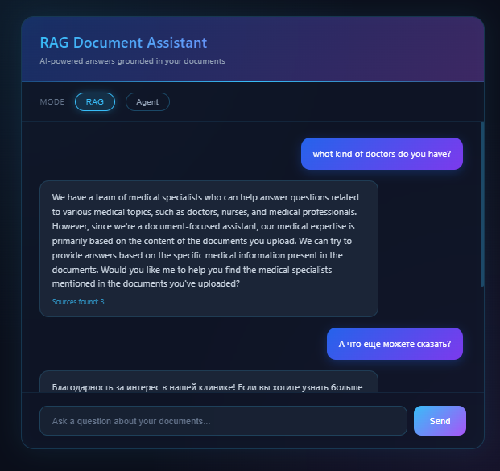
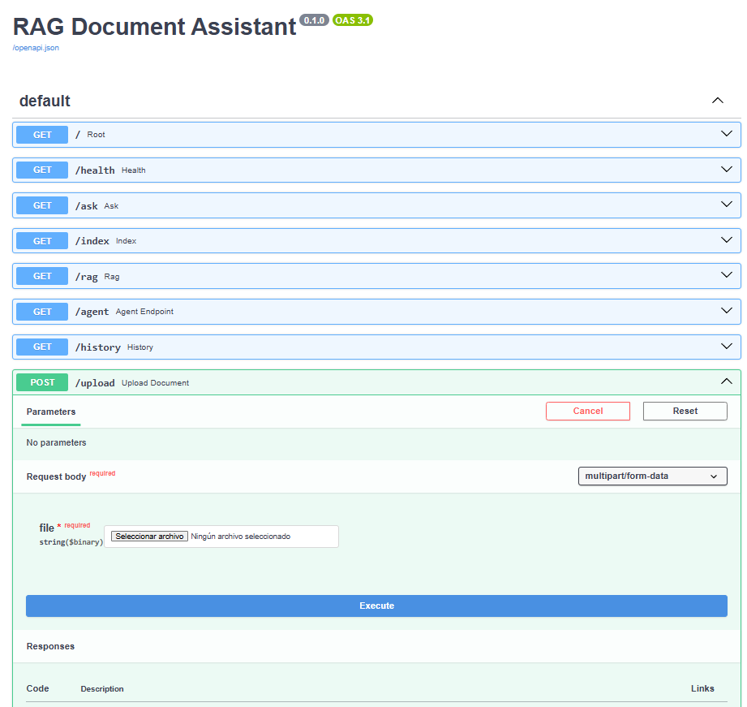

# RAG Document Assistant

An AI-powered document assistant built with **RAG (Retrieval-Augmented Generation)** and an **AI agent**. Upload your documents and ask questions in natural language — the assistant retrieves relevant information and generates accurate, context-grounded answers using a local LLM.

Everything runs locally through Ollama (no API keys, no data leaving your machine), and the whole stack is containerized with Docker.

## Screenshots

### Chat interface
A clean, futuristic chat UI where you can ask questions and switch between RAG and Agent modes.



### Interactive API documentation (Swagger)
FastAPI automatically generates interactive documentation for every endpoint.



## What it does

The assistant answers questions based on the content of your documents, not on the model's general knowledge. It uses semantic search to find the most relevant passages and a local LLM to generate grounded answers. The prompt instructs the model to answer only from the retrieved context and to reply in the same language as the question, which reduces hallucinations and keeps answers on-topic.

It offers two modes:

- **RAG mode** — retrieves relevant chunks from the vector database and generates an answer grounded in them.
- **Agent mode** — a ReAct-style agent that decides on its own which tool to use to answer the question.

## Tech Stack

- **Python** and **FastAPI** — backend and REST API
- **LangChain** — RAG pipeline and agent orchestration
- **Ollama** (llama3.2) — local LLM for answer generation
- **nomic-embed-text** — embeddings model for semantic search
- **Chroma** — vector database
- **PostgreSQL** and **SQLAlchemy** — relational database for query history
- **Docker** and **Docker Compose** — containerized services
- **pytest** — unit and integration tests

## Features

- Document upload and indexing (TXT, PDF) into a vector database
- Semantic search over document content
- RAG-based question answering grounded in the documents
- Conversational, multilingual answers (replies in the language of the question)
- AI agent with tools (ReAct pattern)
- Query history stored in PostgreSQL
- Futuristic web chat interface
- Interactive API documentation via Swagger
- Unit and integration tests with pytest
- Fully containerized with Docker

## API Endpoints

| Method | Endpoint | Description |
|--------|----------|-------------|
| GET | `/` | Web chat interface |
| GET | `/ask?question=...` | Ask the LLM directly (no retrieval) |
| POST | `/upload` | Upload a document and index it |
| GET | `/index?filename=...` | Index a document already in the `documents/` folder |
| GET | `/rag?question=...` | Ask a question answered from the documents (RAG) |
| GET | `/agent?question=...` | Ask the AI agent (chooses tools automatically) |
| GET | `/history` | View query history |

## Architecture

```
User
  |
  v
FastAPI  ->  RAG mode:     Chroma (vector search)  ->  Ollama LLM  ->  grounded answer
         ->  Agent mode:   LangChain ReAct  ->  tools  ->  answer
         ->  History:      PostgreSQL (SQLAlchemy)
```

Documents are split into chunks, converted into embeddings with nomic-embed-text, and stored in Chroma. When a question comes in, the most relevant chunks are retrieved and passed to the LLM together with the question. Every query and answer is saved to PostgreSQL.

## How to run

### Prerequisites
- [Docker](https://www.docker.com/) and Docker Compose
- [Ollama](https://ollama.com/) installed locally

### Setup

1. Clone the repository:
   ```bash
   git clone https://github.com/ElionoraKarimova/rag-document-assistant.git
   cd rag-document-assistant
   ```

2. Pull the required Ollama models:
   ```bash
   ollama pull llama3.2
   ollama pull nomic-embed-text
   ```

3. Create a `.env` file in the project root:
   ```
   POSTGRES_DB=rag_db
   POSTGRES_USER=rag_user
   POSTGRES_PASSWORD=your_password
   OLLAMA_MODEL=llama3.2
   ```

4. Start the services:
   ```bash
   docker compose up -d
   ```

5. Open the web interface at `http://localhost:8000`, upload a document, and start asking questions.

   You can also explore the API at `http://localhost:8000/docs`.

## Running the tests

```bash
docker compose exec web pytest -v
```

The test suite includes both unit tests (endpoint validation) and integration tests (LLM, indexing, RAG, and history).

## Notes

- The LLM runs locally via Ollama, so no API keys are required and no data leaves your machine.
- The RAG prompt instructs the model to answer only from the retrieved context, which reduces hallucinations.
- Chroma stores the document embeddings; PostgreSQL stores the query history — demonstrating work with both a vector database and a relational database in a single project.

---

Built by Elionora Karimova — Junior Backend Developer (Python/Django), transitioning into AI development.